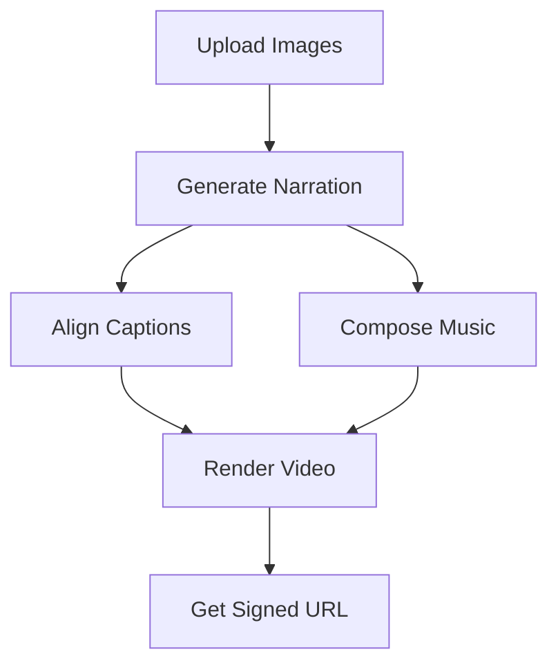

# ReelBanana API Documentation

Welcome to the ReelBanana API documentation! This comprehensive guide covers all the backend services that power the ReelBanana video creation platform.

## 🏗️ Architecture Overview

ReelBanana uses a microservices architecture with the following services:

- **Upload Assets** - Image upload to Google Cloud Storage
- **Narrate** - Text-to-speech narration generation
- **Align Captions** - Caption synchronization with audio
- **Compose Music** - AI-generated background music
- **Render** - Final video rendering with FFmpeg
- **API Key Service** - Secure API key management

## 🔐 Authentication & Security

All services use **Firebase App Check** for request verification. Some services also require **Firebase Authentication** for user-specific operations.

### Required Headers

```http
X-Firebase-AppCheck: <app-check-token>
Authorization: Bearer <firebase-id-token>  # For API Key Service
Content-Type: application/json
```

## 📚 Service Documentation

### Core Services

| Service | Description | OpenAPI Spec | Swagger UI |
|---------|-------------|--------------|------------|
| [Upload Assets](./upload-assets.yaml) | Image upload to GCS | [📄 YAML](./upload-assets.yaml) | [🔗 View](https://reel-banana-upload-assets-423229273041.us-central1.run.app/docs) |
| [Narrate](./narrate.yaml) | Text-to-speech narration | [📄 YAML](./narrate.yaml) | [🔗 View](https://reel-banana-narrate-423229273041.us-central1.run.app/docs) |
| [Align Captions](./align-captions.yaml) | Caption synchronization | [📄 YAML](./align-captions.yaml) | [🔗 View](https://reel-banana-align-captions-423229273041.us-central1.run.app/docs) |
| [Compose Music](./compose-music.yaml) | AI music generation | [📄 YAML](./compose-music.yaml) | [🔗 View](https://reel-banana-compose-music-423229273041.us-central1.run.app/docs) |
| [Render](./render.yaml) | Video rendering | [📄 YAML](./render.yaml) | [🔗 View](https://reel-banana-render-423229273041.us-central1.run.app/docs) |

### Security Services

| Service | Description | OpenAPI Spec | Swagger UI |
|---------|-------------|--------------|------------|
| [API Key Service](./api-key-service.yaml) | Secure API key management | [📄 YAML](./api-key-service.yaml) | [🔗 View](https://reel-banana-api-key-service-423229273041.us-central1.run.app/docs) |

## 🚀 Quick Start

### 1. Get Authentication Tokens

```javascript
// Get Firebase ID token
const user = firebase.auth().currentUser;
const idToken = await user.getIdToken();

// Get App Check token
const appCheckToken = await getAppCheckToken();
```

### 2. Make API Calls

```javascript
const response = await fetch('https://reel-banana-upload-assets-423229273041.us-central1.run.app/upload-image', {
  method: 'POST',
  headers: {
    'Content-Type': 'application/json',
    'X-Firebase-AppCheck': appCheckToken
  },
  body: JSON.stringify({
    projectId: 'proj_123456789',
    fileName: 'scene_1.jpg',
    base64Image: 'data:image/jpeg;base64,/9j/4AAQSkZJRgABAQAAAQ...'
  })
});
```

## 📋 Postman Collection

Download the complete Postman collection for easy API testing:

- [📥 ReelBanana API Collection](./postman/ReelBanana-API.postman_collection.json)
- [📥 Environment Variables](./postman/ReelBanana-Environment.postman_environment.json)

### Import Instructions

1. Open Postman
2. Click "Import" button
3. Upload the collection and environment files
4. Set your Firebase tokens in the environment variables
5. Start testing the APIs!

## 🔄 Typical Workflow

Here's the typical flow for creating a video:



### Example Workflow

```javascript
// 1. Upload images
const uploadResponse = await uploadImage(projectId, fileName, base64Image);

// 2. Generate narration
const narrateResponse = await generateNarration(projectId, script);

// 3. Align captions
const captionResponse = await alignCaptions(projectId, narrateResponse.gsAudioPath);

// 4. Compose music
const musicResponse = await composeMusic(projectId, script);

// 5. Render final video
const renderResponse = await renderVideo(projectId, scenes, {
  gsAudioPath: narrateResponse.gsAudioPath,
  srtPath: captionResponse.srtPath,
  gsMusicPath: musicResponse.gsMusicPath
});
```

## 🛠️ Development Setup

### Local Development

Each service can be run locally for development:

```bash
# Navigate to service directory
cd backend/upload-assets

# Install dependencies
npm install

# Start development server
npm start
```

### Environment Variables

Set these environment variables for local development:

```bash
# Firebase
GOOGLE_APPLICATION_CREDENTIALS=path/to/service-account.json

# ElevenLabs (for narrate service)
ELEVENLABS_API_KEY=your_elevenlabs_key

# Gemini (for compose-music service)
GEMINI_API_KEY=your_gemini_key

# Storage buckets
INPUT_BUCKET_NAME=oneminute-movie-in
OUTPUT_BUCKET_NAME=oneminute-movie-out
```

## 📊 Error Handling

All services return consistent error responses:

```json
{
  "error": "Error message",
  "details": "Additional context (optional)"
}
```

### Common HTTP Status Codes

- `200` - Success
- `400` - Bad Request (missing required fields)
- `401` - Unauthorized (missing or invalid tokens)
- `500` - Internal Server Error

## 🔍 Monitoring & Logging

All services include comprehensive logging and monitoring:

- **Request/Response logging** for debugging
- **Error tracking** with detailed context
- **Performance metrics** for optimization
- **Health checks** for service monitoring

## 📞 Support

For API support and questions:

- **Documentation**: This repository
- **Issues**: GitHub Issues
- **Contact**: [ReelBanana Support](https://reel-banana-35a54.web.app)

## 📄 License

This API documentation is part of the ReelBanana project. See the main repository for licensing information.

---

**Last Updated**: September 6, 2025  
**API Version**: 1.0.0  
**Status**: Production Ready ✅
