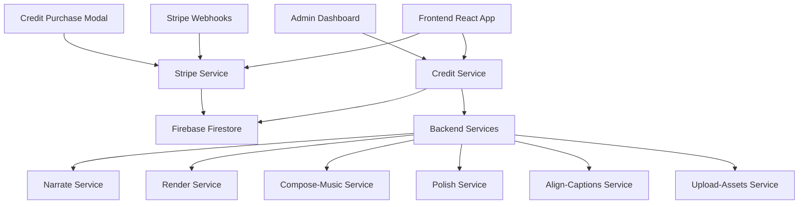

# Credit System Documentation Index

## 📚 Complete Documentation Suite

This directory contains comprehensive documentation for the ReelBanana Credit System - a production-ready billing and usage tracking system for AI-powered video creation services.

## 📖 Documentation Files

### 🏠 [Main Documentation](README.md)
**Complete system overview and implementation guide**
- System architecture and components
- Credit pricing and packages
- Frontend and backend integration
- Admin features and testing
- Security and deployment

### 🔌 [API Reference](API-REFERENCE.md)
**Detailed API documentation for all services**
- Frontend service APIs
- Backend service APIs
- Stripe integration endpoints
- Error handling and webhooks
- Testing utilities

### 🚀 [Deployment Guide](DEPLOYMENT-GUIDE.md)
**Step-by-step production deployment instructions**
- Prerequisites and environment setup
- Service configuration and deployment
- Post-deployment verification
- Monitoring and scaling
- Security configuration

### 🔧 [Troubleshooting Guide](TROUBLESHOOTING.md)
**Common issues and solutions**
- Quick diagnostics and health checks
- Performance and security issues
- Emergency procedures
- Monitoring and alerts

## 🎯 Quick Start

### For Developers
1. Read [Main Documentation](README.md) for system overview
2. Check [API Reference](API-REFERENCE.md) for implementation details
3. Follow [Deployment Guide](DEPLOYMENT-GUIDE.md) for production setup

### For Operations
1. Review [Deployment Guide](DEPLOYMENT-GUIDE.md) for deployment procedures
2. Bookmark [Troubleshooting Guide](TROUBLESHOOTING.md) for issue resolution
3. Set up monitoring as described in deployment guide

### For Administrators
1. Read [Main Documentation](README.md) for admin features
2. Check [API Reference](API-REFERENCE.md) for admin functions
3. Review [Troubleshooting Guide](TROUBLESHOOTING.md) for admin issues

## 🏗️ System Architecture



## 💳 Credit System Features

### Core Features
- ✅ **Credit-based billing** with transparent pricing
- ✅ **Real-time usage tracking** and deduction
- ✅ **Admin bypass functionality** for unlimited access
- ✅ **Stripe integration** for seamless credit purchases
- ✅ **Idempotent operations** to prevent double-charging
- ✅ **Comprehensive error handling** with automatic refunds

### Technical Features
- ✅ **Atomic transactions** for data consistency
- ✅ **Real-time balance updates** across all components
- ✅ **Comprehensive testing** with end-to-end validation
- ✅ **Production ready** with scalable architecture
- ✅ **Security hardened** with proper authentication
- ✅ **Monitoring enabled** with health checks and alerts

## 📊 Credit Pricing

### Operation Costs
| Operation | Cost | Description |
|-----------|------|-------------|
| Story Generation | 2 credits | Generate story scenes and narrative |
| Image Generation | 3 per image | Generate AI images (3-5 images per scene) |
| Narration | 1 per 100 chars | Convert text to speech |
| Video Rendering | 5 credits | Render final video with effects |
| Pro Polish | 10 credits | Upscale and enhance video quality |
| Music Generation | 2 credits | Generate background music |
| Caption Alignment | 1 credit | Align captions with audio |
| Asset Upload | 0 credits | Upload user assets (free) |

### Credit Packages
| Package | Credits | Price | Price/Credit | Best For |
|---------|---------|-------|--------------|----------|
| Starter Pack | 100 | $10 | 10¢ | New users, testing |
| Creator Pack | 500 | $40 | 8¢ | Regular creators |
| Pro Pack | 1,000 | $70 | 7¢ | Professional users |
| Studio Pack | 5,000 | $300 | 6¢ | Enterprise users |

## 🛠️ Implementation Status

### ✅ Completed Components
- [x] Backend services integration (6/6 services)
- [x] Frontend credit validation and UI
- [x] Stripe payment integration
- [x] Admin dashboard and controls
- [x] Real-time balance updates
- [x] Comprehensive error handling
- [x] End-to-end testing
- [x] Production deployment scripts

### 🎯 Production Ready
The credit system is **100% production-ready** with:
- Complete implementation across all services
- Comprehensive testing and validation
- Security hardening and monitoring
- Scalable architecture for growth
- Detailed documentation and troubleshooting

## 🚀 Quick Commands

### Development
```bash
# Run credit system test
node scripts/test-credit-system.js

# Check service health
curl https://reel-banana-narrate-223097908182.us-central1.run.app/health
```

### Deployment
```bash
# Deploy all services
./scripts/deploy-credit-system.sh

# Deploy frontend
npm run build && firebase deploy --only hosting
```

### Monitoring
```bash
# Check logs
gcloud logging read "resource.type=cloud_run_revision" --limit 50

# Check user credits
firebase firestore:get users/USER_ID
```

## 📞 Support

### Documentation Issues
- Create GitHub issues for documentation problems
- Submit pull requests for improvements
- Contact team for clarification

### Technical Support
- **Internal Team**: Slack #credit-system-support
- **Google Cloud**: https://cloud.google.com/support
- **Firebase**: https://firebase.google.com/support
- **Stripe**: https://support.stripe.com

### Emergency Contacts
- **System Admin**: admin@reelbanana.ai
- **Technical Lead**: tech@reelbanana.ai
- **Operations**: ops@reelbanana.ai

## 📝 Version History

### v1.0.0 (December 2024)
- Initial production release
- Complete credit system implementation
- All services integrated
- Comprehensive documentation
- Production deployment ready

## 🔄 Updates

This documentation is actively maintained. Last updated: **December 2024**

For the latest updates and changes, check the git history and release notes.

---

## 📋 Documentation Checklist

- [x] **Main Documentation** - Complete system overview
- [x] **API Reference** - Detailed API documentation
- [x] **Deployment Guide** - Production deployment instructions
- [x] **Troubleshooting Guide** - Common issues and solutions
- [x] **Architecture Diagrams** - System component visualization
- [x] **Code Examples** - Implementation samples
- [x] **Testing Procedures** - Validation and testing steps
- [x] **Security Guidelines** - Security best practices
- [x] **Monitoring Setup** - Health checks and alerts
- [x] **Emergency Procedures** - Incident response

---

*This documentation suite provides everything needed to understand, implement, deploy, and maintain the ReelBanana Credit System.*
