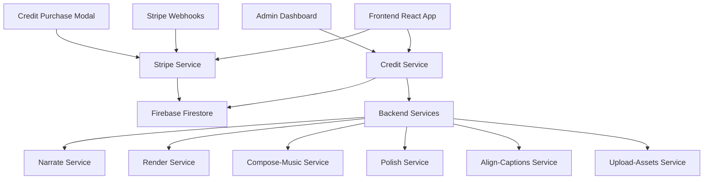

# ReelBanana Credit System Documentation

## Table of Contents
- [Overview](#overview)
- [Architecture](#architecture)
- [Credit Pricing](#credit-pricing)
- [API Reference](#api-reference)
- [Frontend Integration](#frontend-integration)
- [Backend Integration](#backend-integration)
- [Admin Features](#admin-features)
- [Testing](#testing)
- [Deployment](#deployment)
- [Troubleshooting](#troubleshooting)
- [Security](#security)

## Overview

The ReelBanana Credit System is a comprehensive billing and usage tracking system that enables monetization of AI-powered video creation services. It provides:

- **Credit-based billing** with transparent pricing
- **Real-time usage tracking** and deduction
- **Admin bypass functionality** for unlimited access
- **Stripe integration** for credit purchases
- **Idempotent operations** to prevent double-charging
- **Comprehensive error handling** with automatic refunds

### Key Features

- ✅ **Atomic Transactions** - All-or-nothing credit operations
- ✅ **Idempotent Operations** - No double-charging with unique operation IDs
- ✅ **Real-time Balance Updates** - Live credit tracking across all components
- ✅ **Admin Bypass** - Unlimited access for administrators
- ✅ **Stripe Integration** - Seamless credit purchase flow
- ✅ **Comprehensive Testing** - End-to-end validation
- ✅ **Production Ready** - Scalable and secure architecture

## Architecture

### System Components



### Data Flow

1. **User Operation** → Frontend validates credits
2. **Credit Check** → Backend service validates and reserves credits
3. **Operation Execution** → Service performs AI operation
4. **Credit Deduction** → Credits deducted on success
5. **Balance Update** → Real-time balance refresh

### Database Schema

#### Users Collection
```typescript
interface UserProfile {
  uid: string;
  email: string;
  name: string;
  freeCredits: number;
  isAdmin?: boolean;
  stripeCustomerId?: string;
  lastCreditUpdate?: Date;
  lastCreditPurchase?: Date;
  createdAt: Date;
  updatedAt: Date;
}
```

#### Usage Events Collection
```typescript
interface UsageEvent {
  id: string; // Idempotency key
  userId: string;
  operation: 'storyGeneration' | 'imageGeneration' | 'narration' | 'videoRendering' | 'proPolish' | 'musicGeneration' | 'alignCaptions' | 'uploadAsset';
  creditsUsed: number;
  timestamp: Date;
  status: 'pending' | 'completed' | 'failed';
  completedAt?: Date;
  error?: string;
  metadata?: any;
}
```

#### Credit Transactions Collection
```typescript
interface CreditTransaction {
  id: string;
  userId: string;
  type: 'purchase' | 'bonus' | 'refund';
  amount: number;
  description: string;
  timestamp: Date;
  metadata?: {
    packageId?: string;
    paymentIntentId?: string;
    amountPaid?: number;
  };
}
```

## Credit Pricing

### Operation Costs

| Operation | Cost (Credits) | Description |
|-----------|----------------|-------------|
| Story Generation | 2 | Generate story scenes and narrative |
| Image Generation | 3 per image | Generate AI images (3-5 images per scene) |
| Narration | 1 per 100 chars | Convert text to speech |
| Video Rendering | 5 | Render final video with effects |
| Pro Polish | 10 | Upscale and enhance video quality |
| Music Generation | 2 | Generate background music |
| Caption Alignment | 1 | Align captions with audio |
| Asset Upload | 0 | Upload user assets (free) |

### Credit Packages

| Package | Credits | Price | Price/Credit | Best For |
|---------|---------|-------|--------------|----------|
| Starter Pack | 100 | $10 | 10¢ | New users, testing |
| Creator Pack | 500 | $40 | 8¢ | Regular creators |
| Pro Pack | 1,000 | $70 | 7¢ | Professional users |
| Studio Pack | 5,000 | $300 | 6¢ | Enterprise users |

### Free Tier

- **Monthly Credits**: 50 credits
- **Resolution**: 480p maximum
- **Watermark**: Required on all videos
- **Features**: Basic templates only
- **Scene Limit**: 3 scenes maximum

## API Reference

### Frontend Services

#### Credit Service (`services/creditService.ts`)

```typescript
// Reserve credits for an operation
const result = await reserveCredits(
  'storyGeneration', 
  { topic: 'adventure story' },
  { topic: 'adventure story', forceUseApiKey: false }
);

// Complete an operation
await completeCreditOperation(
  result.idempotencyKey, 
  'completed'
);

// Get user's credit balance
const balance = await getCreditBalance();

// Purchase credits
const purchaseResult = await purchaseCredits(
  'creator', // package ID
  'pm_1234567890' // payment method ID
);
```

#### Usage Tracking Hook (`hooks/useUsageTracking.ts`)

```typescript
const {
  freeCredits,
  totalUsage,
  isLoading,
  refreshCredits,
  hasEnoughCredits
} = useUsageTracking();

// Check if user has enough credits
const canGenerate = hasEnoughCredits('imageGeneration', { imageCount: 5 });
```

### Backend Services

#### Credit Service (`backend/shared/creditService.js`)

```javascript
// Middleware to check credits before processing
app.post('/operation', 
  requireCredits('imageGeneration', (req) => ({ imageCount: req.body.images?.length || 0 })),
  deductCreditsAfter('imageGeneration', (req) => ({ imageCount: req.body.images?.length || 0 })),
  async (req, res) => {
    // Operation logic here
    
    // Complete credit operation on success
    if (req.creditDeduction?.idempotencyKey) {
      await completeCreditOperation(req.creditDeduction.idempotencyKey, 'completed');
    }
    
    res.json({ success: true });
  }
);
```

#### Stripe Service Endpoints

```javascript
// Purchase credits
POST /purchase-credits
{
  "packageId": "creator",
  "paymentMethodId": "pm_1234567890"
}

// Get subscription status
GET /subscription-status

// Webhook for payment events
POST /webhook
```

## Frontend Integration

### Components

#### Credit Balance Display (`components/CreditBalance.tsx`)

```typescript
<CreditBalance 
  showPurchaseButton={true}
  className="flex items-center gap-2"
/>
```

#### Operation Cost Display (`components/OperationCostDisplay.tsx`)

```typescript
<OperationCostDisplay
  operation="imageGeneration"
  params={{ imageCount: 5 }}
  onInsufficientCredits={() => setShowCreditPurchase(true)}
  className="mb-4"
/>
```

#### Credit Purchase Modal (`components/CreditPurchaseModal.tsx`)

```typescript
<CreditPurchaseModal
  isOpen={showCreditPurchase}
  onClose={() => setShowCreditPurchase(false)}
  onSuccess={() => {
    window.location.reload(); // Refresh credits
  }}
/>
```

### Usage Examples

#### Story Generation with Credit Check

```typescript
const handleGenerateStory = async (topic: string) => {
  // Check credits before proceeding
  const { freeCredits, isAdmin } = useUserCredits();
  const requiredCredits = 2;
  
  if (!isAdmin && freeCredits < requiredCredits) {
    toast.error(`Insufficient credits. Need ${requiredCredits} credits.`);
    setShowCreditPurchase(true);
    return;
  }

  // Proceed with generation
  const result = await generateStory(topic);
  await refreshCredits(); // Update balance
};
```

#### Image Generation with Cost Display

```typescript
const ImageGenerationButton = () => {
  const imageCount = 5;
  
  return (
    <div>
      <OperationCostDisplay
        operation="imageGeneration"
        params={{ imageCount }}
        onInsufficientCredits={() => setShowCreditPurchase(true)}
      />
      <button onClick={handleGenerateImages}>
        Generate {imageCount} Images
      </button>
    </div>
  );
};
```

## Backend Integration

### Service Integration Pattern

Each backend service follows this pattern:

1. **Import credit service**
2. **Add credit middleware**
3. **Complete operations on success**
4. **Handle failures with refunds**

#### Example: Narrate Service

```javascript
const { requireCredits, deductCreditsAfter, completeCreditOperation } = require('./shared/creditService');

app.post('/narrate', 
  requireCredits('narration', (req) => ({ textLength: req.body.narrationScript?.length || 0 })),
  deductCreditsAfter('narration', (req) => ({ textLength: req.body.narrationScript?.length || 0 })),
  async (req, res) => {
    try {
      // Generate narration
      const result = await generateNarration(req.body.narrationScript);
      
      // Complete credit operation
      if (req.creditDeduction?.idempotencyKey) {
        await completeCreditOperation(req.creditDeduction.idempotencyKey, 'completed');
      }
      
      res.json({ gsAudioPath: result.path });
    } catch (error) {
      // Mark operation as failed
      if (req.creditDeduction?.idempotencyKey) {
        await completeCreditOperation(req.creditDeduction.idempotencyKey, 'failed', error.message);
      }
      
      res.status(500).json({ error: error.message });
    }
  }
);
```

### Credit Service Functions

#### `requireCredits(operation, getParams)`
Middleware that checks if user has enough credits before processing.

#### `deductCreditsAfter(operation, getParams)`
Middleware that reserves credits after validation.

#### `completeCreditOperation(idempotencyKey, status, error)`
Marks an operation as completed or failed.

#### `checkUserCredits(userId, operation, params)`
Checks if user has sufficient credits for an operation.

#### `deductCredits(userId, operation, params, idempotencyKey)`
Deducts credits from user account atomically.

## Admin Features

### Admin Dashboard (`components/AdminUsageDashboard.tsx`)

The admin dashboard provides:

- **Real-time usage statistics**
- **Revenue tracking**
- **User credit management**
- **Transaction history**
- **Service health monitoring**

### Admin Functions

```typescript
// Add bonus credits to user
await addBonusCredits(userId, 100, 'Welcome bonus');

// Update user credits
await updateUserCredits(userId, 500);

// Reset user credits
await resetUserCredits(userId);

// Get usage summary
const summary = await getAdminUsageSummary();

// Get detailed usage events
const events = await getDetailedUsageEvents(userId, 50);
```

### Admin Bypass

Admin users automatically bypass all credit checks:

```typescript
// In credit validation
if (isAdmin) {
  return { hasCredits: true, isAdmin: true, credits: 999999 };
}
```

## Testing

### Unit Tests

```bash
# Run credit system tests
npm test -- --testPathPattern=credit

# Run specific test file
npm test services/creditService.test.ts
```

### Integration Tests

```bash
# Run end-to-end credit flow test
node scripts/test-credit-system.js
```

### Test Coverage

- ✅ Credit reservation and deduction
- ✅ Operation completion and failure
- ✅ Admin bypass functionality
- ✅ Insufficient credits handling
- ✅ Stripe integration
- ✅ Error scenarios and refunds

### Manual Testing Checklist

- [ ] User can purchase credits via Stripe
- [ ] Credits are deducted correctly for each operation
- [ ] Insufficient credits prevent operations
- [ ] Admin users bypass credit checks
- [ ] Failed operations refund credits
- [ ] Real-time balance updates work
- [ ] Credit purchase modal functions correctly

## Deployment

### Prerequisites

- Firebase project configured
- Stripe account with webhooks
- Google Cloud Run services
- Environment variables set

### Environment Variables

```bash
# Stripe
STRIPE_SECRET_KEY=sk_live_...
STRIPE_PUBLISHABLE_KEY=pk_live_...
STRIPE_WEBHOOK_SECRET=whsec_...

# Firebase
FIREBASE_PROJECT_ID=reel-banana-35a54
GOOGLE_APPLICATION_CREDENTIALS=path/to/service-account.json

# Services
ELEVENLABS_API_KEY=sk_...
FAL_API_KEY=...
```

### Deployment Steps

1. **Deploy Backend Services**
```bash
./scripts/deploy-credit-system.sh
```

2. **Deploy Firebase Functions**
```bash
firebase deploy --only functions
```

3. **Deploy Frontend**
```bash
npm run build
firebase deploy --only hosting
```

4. **Configure Stripe Webhooks**
- Set webhook URL: `https://your-stripe-service.com/webhook`
- Enable events: `payment_intent.succeeded`, `payment_intent.payment_failed`

### Health Checks

```bash
# Check all services
curl https://reel-banana-narrate-223097908182.us-central1.run.app/health
curl https://reel-banana-render-223097908182.us-central1.run.app/health
curl https://reel-banana-stripe-service-223097908182.us-central1.run.app/health
```

## Troubleshooting

### Common Issues

#### Credits Not Deducted
- Check if operation completed successfully
- Verify idempotency key is unique
- Check Firestore transaction logs

#### Stripe Payment Failed
- Verify webhook endpoint is accessible
- Check Stripe webhook logs
- Ensure payment method is valid

#### Admin Bypass Not Working
- Verify user has `isAdmin: true` in Firestore
- Check admin status in user profile
- Refresh user session

#### Real-time Updates Not Working
- Check `useUserCredits` hook implementation
- Verify `refreshCredits()` is called after operations
- Check for JavaScript errors in console

### Debug Commands

```bash
# Check user credits
firebase firestore:get users/USER_ID

# Check usage events
firebase firestore:get usage_events --limit 10

# Check credit transactions
firebase firestore:get credit_transactions --limit 10

# View service logs
gcloud logging read "resource.type=cloud_run_revision" --limit 50
```

### Error Codes

| Code | Description | Solution |
|------|-------------|----------|
| `INSUFFICIENT_CREDITS` | User doesn't have enough credits | Purchase more credits |
| `OPERATION_FAILED` | AI operation failed | Check service logs, refund credits |
| `PAYMENT_FAILED` | Stripe payment failed | Check payment method |
| `INVALID_OPERATION` | Unknown operation type | Check operation name |
| `DUPLICATE_OPERATION` | Idempotency key already used | Generate new idempotency key |

## Security

### Security Measures

- **Idempotent Operations** - Prevent double-charging
- **Atomic Transactions** - Ensure data consistency
- **Admin Authentication** - Secure admin access
- **Stripe Webhook Verification** - Validate payment events
- **Rate Limiting** - Prevent abuse
- **Input Validation** - Sanitize all inputs

### Best Practices

1. **Always use idempotency keys** for credit operations
2. **Validate user permissions** before operations
3. **Log all credit transactions** for audit trails
4. **Use atomic transactions** for credit updates
5. **Implement proper error handling** with refunds
6. **Monitor for unusual usage patterns**

### Compliance

- **PCI DSS** - Stripe handles card data
- **GDPR** - User data protection
- **SOC 2** - Security controls
- **Audit Trails** - Complete transaction logging

---

## Support

For technical support or questions about the credit system:

- **Documentation**: This file and inline code comments
- **Issues**: Create GitHub issues for bugs
- **Admin Access**: Contact system administrators
- **Stripe Support**: Use Stripe dashboard for payment issues

---

*Last updated: December 2024*
*Version: 1.0.0*
